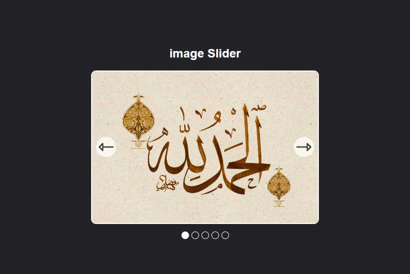

# Image Gallery Slider

This project is an Image Gallery Slider that allows users to navigate through a collection of images using navigation buttons or automatic transitions. It also includes pagination bullets to indicate the current image

## Table of Contents

- [Image Gallery Slider](#image-gallery-slider)
  - [Table of Contents](#table-of-contents)
  - [Features](#features)
  - [Technologies Used](#technologies-used)

## Features

- **Responsive Design**: The slider adjusts to different screen sizes.
- **Navigation Buttons**: Users can navigate through images using left and right buttons.
- **Automatic Slideshow**: Images change automatically after a set interval.
- **Pagination Bullets**: Indicates the current image and allows users to jump to any image.
- **Hover Pause**: Slideshow pauses when the mouse hovers over the slider.

## Technologies Used

- HTML5
- CSS3
- JavaScript
